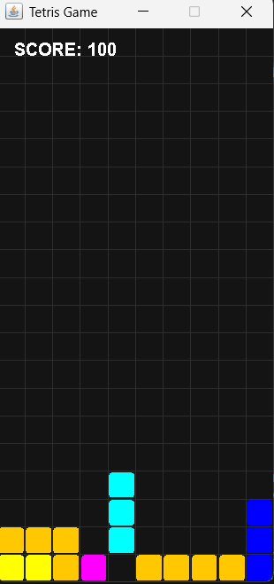
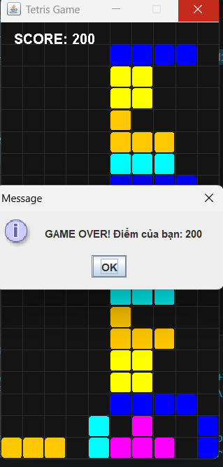

# 🎮 Game Xếp Gạch Tetris

> Bài tập lớn môn Lập trình Java

---

## 👥 Thành viên nhóm

| STT | Họ và Tên                                         | Vai trò        |
| --- | -----------------                                 | -------------- |
| 1   | Nguyen Huu Nguyen                                 | Code chính     |
| 2   | Ma Tien Duc                                       | Thiết kế GUI   |
| 3   | Tang Tan Duy Phuc                                 | Xử lý logic    |
| 4   | Ma Tien Duc, Nguyen Huu Nguyen,Tang Tan Duy Phuc  | Test & báo cáo |

---

## 📝 Giới thiệu dự án

Đây là game Tetris được xây dựng bằng Java Swing. Người chơi điều khiển các khối gạch rơi xuống, sắp xếp để tạo thành hàng ngang hoàn chỉnh để ghi điểm. Game kết thúc khi các khối gạch chạm đỉnh màn hình.

---

## ✨ Chức năng chính

* Điều khiển gạch (trái, phải, xoay)
* Gạch rơi tự động
* Xóa hàng khi đầy
* Tính điểm
* Game Over khi đầy màn hình

---

## 💻 Công nghệ sử dụng

* Ngôn ngữ: Java
* Giao diện: Java Swing
* Kiến trúc: MVC (Model - View - Controller)

---

## 📂 Cấu trúc project

```
src/
 ┣ model
 ┣ view
 ┣ controller
 ┣ utils
 ┗ Main.java
```

---

## 🚀 Hướng dẫn chạy

### Cách 1: Chạy file JAR

```
java -jar TetrisGame.jar
```

### Cách 2: Chạy bằng code

* Mở project bằng IDE (VS Code / IntelliJ)
* Chạy file `Main.java`

---

## 📸 Demo




---

## 📌 Ghi chú

* Game được phát triển phục vụ mục đích học tập
* Có thể mở rộng thêm âm thanh, level, lưu điểm cao

